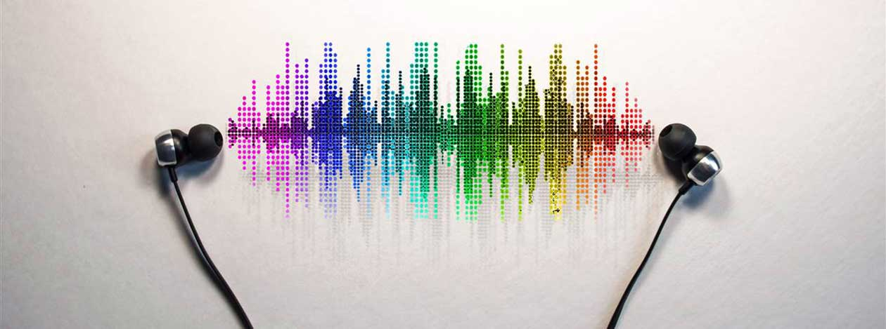

**Business Problem**

The music industry is a subjective industry. So it's hard to pinpoint what genre,artist or song a listener may like. In this repo we built a music recommendation system using data from Last.fm. The recommendation system may assist a record label to predict what artists to market to which consumers.

**The Dataset**

In this repo you will find code for a recommendation system using the dataset from Last.Fm that was found on [GroupLens](https://grouplens.org/datasets/hetrec-2011/)

Data included the following features:  

user_artists.dat (userID, artistID, weight). Plays of artist by user.  
artists.dat (id, name, url, pictureURL). ID and name of each artist.  
tags.dat (tagID, tagValue). ID number and content for each tag.  
user_taggedartists.dat (userID, artistID, tagID, day, month, year). Tag of artist by user with date.  
user_taggedartists-timestamps.dat (userID, artistID, tagID, timestamp). Tag of artist by user with timestamp.  
user_friends.dat (userID, friendID). User/friend relationships.  

Total dataset: 

1,892 users 
17,632 artists 
92,834 artist/user plays 
11,946 tags 
186,479 tag assignments 

**Models Used**
- Knn with surprise
- SVD
- Knn with SciKit Learn

Recommendation systems map the distances between similarities. In our case we are going to map the distance between artists. I used the cosine similarity but also tested pearson correlation and jaccard similarity

The cosine similarity is good for comparing the ratings of items, but does not consider the differences in mean and variance of the items.  
The jaccard similarity is a good choice for implicit item feedback (ie binary feedback such as like/dislike or played/not played).  
The pearson Correlation similarity also comparies the ratings of items and effects of mean and variance have been removed.  

**Improve Accuracy**

The average accuracy for the current model is 6 out of top 10 recommendations. Just about 60%. This was measured by asking users(friends) what was their favorite artist between 2006 and 2011. The model then recommended 10 artist according to the users favorite artist. After recieving recommendations the user chose which artist they would listen to our not. On average users would listen to 6 out of 10 artist with some users above and below the average. To improve the accuracy the dataset also has tags for genres that could be used to create more features and input into the model
